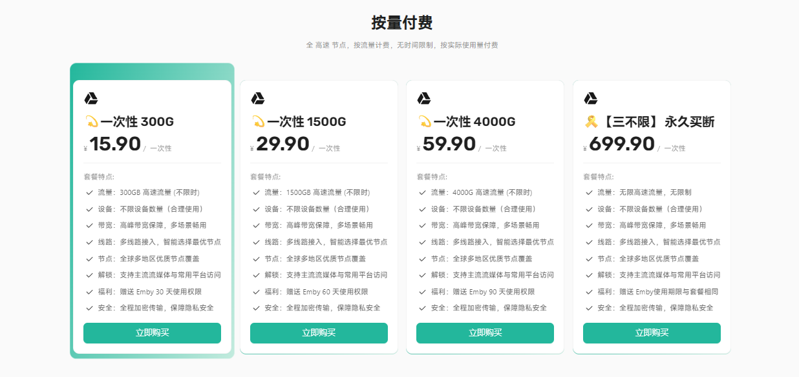
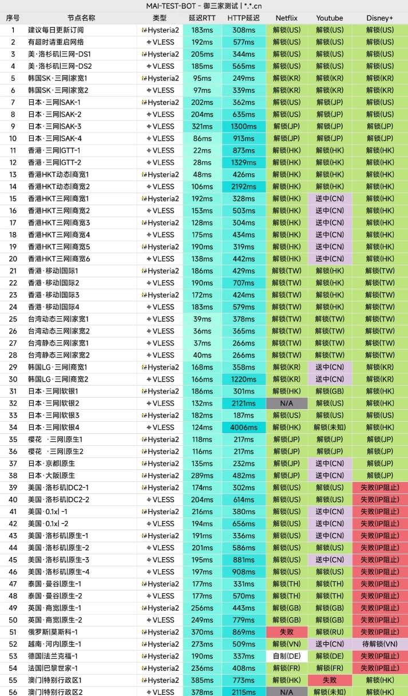
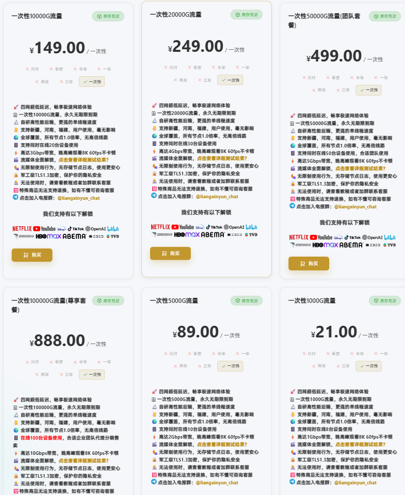
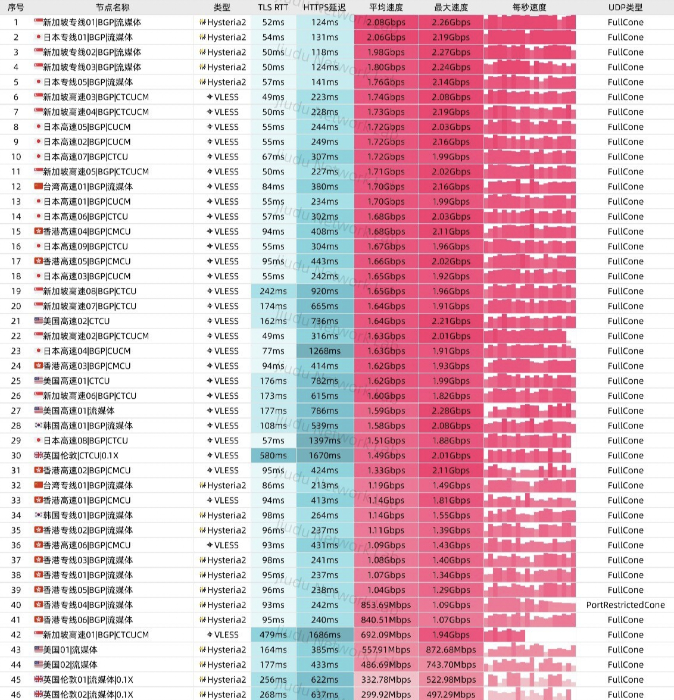
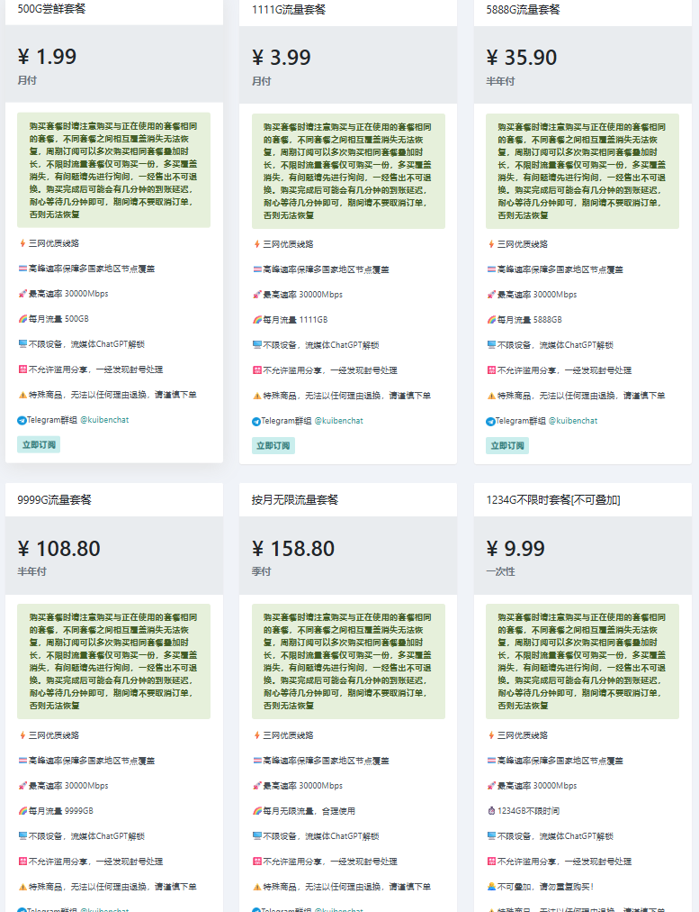

# 低价机场/VPN 推荐（2026 年 5 月更新）https://myikuns.github.io/vpn/

此网站跟随此页面更新，之前缓存过的建议**多次刷新确保更新缓存**

日常更新不多，但**每一条都是自己长期实测**过的! 
目前属于特殊时期，节点多少都会有波动，**建议多备几个**做备用! 
注目前专线、中转时长波动不稳定，最近频繁拔线且用且珍惜吧！

## 纯净 IP 补充（电商/AI/高要求场景）
需要静态住宅 IP 或动态短效 IP → [**《点此查看》**](https://share.cliproxy.com/share/f57m8w8j2)

# 一、顶尖推荐（富哥首选）
| 序号 | 机场名（点击跳转详情） | 官网 | 套餐与特色（默认月付） |
| -------- | -------- | -------- | -------- |
| 1  | [TAG](#TAG) | [官网](https://558343.dedicated-afflink.com/#/auth/dvmePpjQ) | ¥114/500GB **含有250+条高速线路与超多家宽线路 覆盖全球100+个国家(含卫星网络)** |
| 2  | [奶昔](#奶昔) | [官网](https://nxonearth.com/signupbyemail.aspx?MemberCode=a382c243c1454800a5680e4ff54aa67220260518153643) | ¥74.55/200GB **老牌顶级线路机场、速度快，但稳定较差，树大招风** |
| 3  | [肯の机](#肯の机) | [官网](https://kendeji.io/#/auth?invite=uu15Kzxj) | ¥35/100GB(直连+家宽)**超低倍率0.05倍节点 全线路CN2 GIA + 9929 + CMIN2!延迟低！** |
| 4  | [西部数据](#西数) | [官网](https://wd-gold.net/aff.php?aff=14681) | ¥20/200GB,**线路为国际IPLC+大陆BGP多线接入、线路优质性价比超高！** |
| 5  | [苏菲家宽](#苏菲家宽) | [官网](https://sufe.pro/#/register?code=wRwmqe9Q) | ¥50/800GB【星链版】 ¥9.9/1TB【纯直连】 ¥20/250G【美国家宽车】 内有日本、美国等星链家宽！ **$${\color{red}{直连版无家宽！}}$$** |

# 二、主力推荐（性价比）
| 序号 | 机场名（点击跳转详情） | 官网 | 套餐与特色（默认月付） |
| -------- | -------- | -------- | -------- |
| 1  | [悦通](#悦通) | [官网](https://yk1u.yue.to/#/register?code=JqCr6Tpn) | ￥49.9年付/200G(平均4.15元/月)¥12.9月付/1TB 送永久Emby,**套餐介绍有💎的含家宽节点** |
| 2  | [雪山机场](#雪山机场) | [官网](https://www.xueshan.shop/#/register?code=h0lPgItf) | ¥9.9月付/500GB,¥29.9/1.5TB(长期) ¥699/永久,送期限Emby,**含家宽节点** |
| 3  | [雨燕云](#雨燕云) | [官网](https://new4.yuyan.online/#/register?code=Pe2RS8uV) | ¥13.8/158GB,有CN2/9929/CMIN2且六线智能BGP负载均衡！ |
| 4  | [XSUS](#XSUS) | [官网](https://xsus1.com/register?code=6LiiWirT) | ¥12/168GB,有越、美、日、港台澳等家宽节点，有专属IPEL专线！ |
| 5  | [XFLTD](#XFLTD) | [官网](https://my.xfltd.org/#/register?code=ptlnb86g) | ¥7/150GB,拥有优质公网中转！解锁常见流媒体&AI平台！ |
| 6  | [落云](#落云) | [官网](https://88888.ee88.tk/#/register?code=UVI42l9q) | ¥12/300GB,**$${\color{red}{有南极、冰岛等稀缺iP,原生IP,住宅iP,另外可以更改抖音红薯IP}}$$** |
| 7  | [搅局者](#搅局者) | [官网](https://xn--dgtr4ppoz.com/#/register?code=PWV5Y7dc) | ¥16.9一年不限量！但限制设备2台！ |
| 8  | [良心云](#良心云) | [官网](https://xn--9kqz23b19z.com/#/register?code=yZcE4Uf3) | ¥2/100GB,￥4/500GB、三网优化、速度超快、晚高峰超快 目前有七折码：爱你如初LXY |
| 9  | [狗子云](#狗子云) | [官网](https://gz-cloud.top/#/register?code=kDV2n3tI) | ¥3/168GB,有香港与台湾住宅IP以及美国原生IP、**可分销**、超低价格 |

# 三、备用推荐（低价）
| 序号 | 机场名（点击跳转详情） | 官网 | 套餐与特色（默认月付） |
| -------- | -------- | -------- | -------- |
| 1 | [墨菲云](#墨菲云) | [官网](https://portal.mofeiyun.com/#/register?code=6pErwD6V) | ¥3.2/222GB(直连+家宽)¥6.6/1111G,**联通不推荐**！有0.1x节点 永久95折折扣码：**MFXY95%yyds** |
| 2 | [Kitty Network](#kitty-network) | [官网](https://kitty.sb/#/register?code=UZPduMjD) | ¥24年付/128G（平均2元/月） |
| 3 | [蜜雪冰城](#蜜雪冰城) | [官网](https://kad520.uk/#/register?code=5UplgCKR) | ¥2月付/100GB,￥21/100GB(长期),含电信专属优化、BGP与0.5x低倍率节点 |
| 4 | [果冻加速](#果冻加速) | [官网](https://naichachong.com/#/register?code=yO3p6doW) | ¥9.9/不限量（月付）  速度快、无审计、不限量！适合流媒体&PT下载！ |
| 5 | [赔钱机场](#赔钱机场) | [官网](https://xn--mes358aby2apfg.com/register?code=esmud6xa&cover=sfw) | ¥1.5月/100G,￥2.99月/500G |
| 6 | [亏本机场](#亏本机场) | [官网](https://xn--7kq24s4ynvb.site/#/register?code=XZxkVGXN) | ¥2/500G(月付)¥10/1234GB(长期) 经济实惠、流媒体解锁、不限制设备！ |

> **家宽/电商**：**悦通**（目前有台湾/美国/日本/韩国/越南 ISP 家宽节点，套餐带💎有家宽节点与专属AI节点！）狗子云（主要是香港与台湾住宅IP，以及美国的原生IP）   

> **专线/星链**：**苏菲家宽**目前有专属星链专线，且有独家星链家宽网络！还有特色的拼车套餐-美国静态家宽车只要20￥/250GB！  **XSUS*** 拥有专属IPEL专线，游戏节点等企业专线套餐！

> **影视/Emby/永久**：**悦通&雪山**、 悦通主要是性价比优于雪山，便宜实惠！永久套餐搭配emby直接完美！但目前emby正在完善！雪山则是emby有期限，根据套餐时间来定制！永久除外！

### TAG
**套餐价格：¥114/500G  ¥219/999G  ¥185(季付)/每月250GB**

**特点(就是家宽多、线路超级丰富)：**
* 提供250+ 条高速线路，覆盖全球 100+ 个国家和地区(含卫星网络)，畅享低延迟体验！超多家宽节点！
* 解锁Netfilx、Hulu、HBO、Disney+、Dazn等主流流媒体平台的区域限制！
* 解锁ChatGPT、Claude、 Gemini、Cursor等主流 AI 工具的区域限制
* 注意！最多【10】个设备同时链接使用！不保证【Tiktok】能用、不保证【抖音、快手、微博、B站等大陆应用】修改定位!

[官网跳转](https://558343.dedicated-afflink.com/#/auth/dvmePpjQ)

套餐价格

### 奶昔
**套餐价格：¥74.55/200GB ¥123.33/500GB  ^  ¥170.1/500G(中美金融专线)**

特点：
* 主流节点都有、节点质量高，速度快！
* 解锁Netfilx、Disney+等主流流媒体平台的区域限制！
* 解锁ChatGPT、Claude、 Gemini、Cursor等主流 AI 工具的区域限制！
* 注意！最多【2】个设备同时链接使用！可以加购日本、美国、韩国 Anycast网络·中美金融专线！

[官网跳转](https://nxonearth.com/signupbyemail.aspx?MemberCode=a382c243c1454800a5680e4ff54aa67220260518153643)

套餐价格

节点列表

  

### 肯の机
**套餐价格：￥35/100GB ￥70/200GB ￥105/300G ￥300/1TB**

**最新优惠：顶尖机场、顶尖体验、暂无优惠！前期建议先买最便宜测试使用！**

特点：
* 提供🚀GTM均衡优化入口线路负载 带V6入口 GOMAMI DMIT等入口 AKARI等出口
* 速率高达2Gbps、无限制同时连接 IP 数！ 附带部分家宽节点！
* 全1倍率节点,赠超低0.01倍率！
* 解锁全流媒体解锁和全AI解锁！！！

[官网跳转](https://kendeji.io/#/auth?invite=uu15Kzxj)

套餐价格

测速

### 西数
**套餐价格：¥20/200GB ¥40/400GB ¥60/600GB**

特点：
* 国际 IPLC 传输线路+中国大陆 BGP 多线接入!
* 解锁Netfilx、Disney+等主流流媒体平台的区域限制！
* 解锁ChatGPT、Claude、 Gemini、Cursor等主流 AI 工具的区域限制！

[官网跳转](https://wd-gold.net/aff.php?aff=14681)

套餐价格

### 苏菲家宽

**最新优惠：🔥五一活动(5.1-5.15)优惠码：51888🔥**

套餐价格：¥50/800GB【星链版】¥9.9/1TB【纯直连】¥20/250G【美国静态家宽车】¥40/550GB【美国动态家宽】

特点：
* 内有日本、美国等星链家宽、IEPL专线、真实ISP指纹，原生住宅环境！
* 包含全套静态节点 (美/日/台/英/尼/欧) 具体看套餐简介！晚高峰优秀！
* 另外有专属美国家宽车只要20￥/250GB！具体注册查看即可！

[苏菲家宽官网](https://sufe.pro/#/register?code=wRwmqe9Q)

套餐价格

### 悦通
[悦通官网](https://yk1u.yue.to/#/register?code=JqCr6Tpn)

**最新优惠：🔥五二零活动(5.18-5.23)七折优惠码：YUE520**

**近期专属节点与普通节点均已完成升级优化，整体速度与体验进一步提升!**  
带💎套餐为家宽套餐(带💎套餐目前有台湾/美国/日本/韩国/越南五大家宽节点与专属AI节点)  
**$${\color{red}{另有不定期余额抽奖、有永久套餐、支持链式代理！还有Emby专属!}}$$**  
强烈建议使用《[专属APP](https://github.com/onesyue/yuelink)》不然有的节点不通且无emby！！  

**套餐价格：¥12.9/1TB（月付）   ¥19.9/500G（长期） ¥520/永久**  强烈建议购买家宽套餐，普通套餐体感一般！

特点：
* **专属APP签到送流量**,**TG群聊可以二次签到、日常群里不定时送官网余额抽奖等！**
* 顶级专线资源的“降维打击”：不同于市面上的普通公网中转，悦通在核心节点（港/台/日/新/美）部署了 Premium 和 专属 高端线路。
* 硬核配置：接入 HKT (香港电讯)、Hinet (台湾中华电信)、AWS 等企业级资源。
* 体验：超低延迟，极强抗干扰，晚高峰稳如老狗，直接对标一线大厂体验！
* 购买套擦免费送永久Emby！
* 解锁 Netflix、YouTube、TikTok、OpenAI 等主流服务
* [-节点列表点我查看-](https://status.yue.to/status)支持的地区包括：香港、台湾、🇯🇵 日本、🇰🇷 韩国、🇸🇬 新加坡、🇺🇸 美国、🇨🇦 加拿大、🇻🇳 越南、🇲🇾 马来西亚、🇹🇭 泰国、🇮🇳 印度、🇦🇪 阿联酋、🇪🇸 西班牙、🇸🇪 瑞典、🇳🇱 荷兰、🇩🇪 德国、🇬🇧 英国、🇷🇺 俄罗斯、🇹🇷 土耳其、🇳🇬 尼日利亚、🇧🇷 巴西、🇦🇺 澳大利亚、澳门、🇲🇳 蒙古、🇰🇭 柬埔寨、🇲🇲 缅甸、🇱🇦 老挝、🇵🇭 菲律宾、🇮🇩 印度尼西亚、🇵🇰 巴基斯坦、🇹🇱 东帝汶、🇦🇫 阿富汗、🇺🇦 乌克兰、🇻🇦 梵蒂冈、🇧🇲 百慕大、🇬🇱 格陵兰、🇦🇷 阿根廷、🇨🇺 古巴、🇪🇬 埃及、🇸🇴 索马里、🇫🇯 斐济、🇸🇧 所罗门群岛、🇬🇺 关岛、🇦🇶 南极洲…… 节点数量多、分布广，随时畅享全球高速网络！
* 328元终身永久不限量99T高速流量
* 520元终身永久不限流量，无限带宽，买断即享，彻底告别流量焦虑

[悦通官网](https://yk1u.yue.to/#/register?code=JqCr6Tpn)

套餐价格

  

### 雪山机场

套餐价格：29.9元/年 200G/月（平均2.5元/月）送Emby

特点：
* 有家宽节点（香港，台湾，韩国等）
* 订阅任意套餐即可免费使用 Emby，支持在线观看电影、剧集、动漫等内容，手机 / 电脑 / 平板多端播放。
* 电信/联通/移动 多线接入
* 不限连接数量
* **包含原生，家宽节点**

[雪山机场官网](https://www.xueshan.shop/#/register?code=h0lPgItf)

套餐价格

测速

### 雨燕云
套餐价格：¥13.8/158G  ¥29.8/512G 

特点：
* CN2/9929/CMIN2 六线智能BGP负载均衡
* 50+ 全球节点可选、节点丰富！
* 支持访问各类AI网站以及流媒体网站
* 个人使用不限制设备数量！

[官网跳转](https://new4.yuyan.online/#/register?code=Pe2RS8uV)

套餐价格

三网测速

移动
联通
电信

流媒体解锁

### XSUS

套餐价格：¥12/168GB 

IEPL企业专线套餐：￥52季付/50G

特点：
* 有越南、美国、日本、香港台湾澳门等家宽节点，同时也是五年老牌机场！
* 服务超级稳定、超低延迟、节点众多！速度快！
* 三网延迟优化，节点丰富，体验很好！
* 拥有专属IPEL专线，游戏节点等企业专线套餐！

[XSUS官网](https://xsus1.com/register?code=6LiiWirT)

套餐价格

### XFLTD

套餐价格：¥7/150GB ¥14/300GB ¥24/120G(长期)

特点：
* 有🇭🇰 香港、🇯🇵 日本、🇹🇼 台湾、🇸🇬 新加坡、🇺🇸 美国等节点，同时也是六年老牌机场！
* 服务稳定、超低延迟、节点众多！速度快！性比价高！
* 三网延迟优化，节点丰富，体验很好！
* 拥有优质公网中转线路，延迟优化良好！

[官网注册点我](https://my.xfltd.org/#/register?code=ptlnb86g)

套餐价格

### 良心云
套餐价格：¥2/100GB,￥4/500GB

优惠(截至5.22晚24点)：目前有七折码：爱你如初LXY

特点：
* 支持新疆，河南，福建，用户使用
* 无限制使用行为，无存储节点日志

[良心云官网](https://xn--9kqz23b19z.com/#/register?code=yZcE4Uf3)

套餐价格

测速

### 狗子云
套餐价格：￥3/168GB ￥5/168(分销版)

最新优惠：🔥五一活动(4.29-5.5)六六折优惠码：五一🔥 注：VIP1、不限量、分销套餐不可使用！

特点：
* 提供原生IP，动态家宽支持
* 不限速、内带分销套餐，可以自行销售！
* 内含0.1x 倍率节点 · 下载/观影更安心
* 解锁 OpenAI / Netflix / TikTok / YouTube 等热门服务 

[狗子云官网](https://gz-cloud.top/#/register?code=kDV2n3tI)

套餐价格

### 落云

套餐价格： ¥7/300G（月付）¥23/600GB（月付） **此机场不定时更换价位、需要早买以防涨价！折扣码：60FFF**

特点：[节点列表](https://88888.ee88.tk/#/nodes)
* 南极 冰岛等稀缺iP 原生iP 住宅iP
* 解锁：Netflix, ChatGPT, Gemini 等
* 网速不限速 同时在线设备不限制 可改抖音iP 小红书iP

[落云官网](https://88888.ee88.tk/#/register?code=UVI42l9q)

套餐价格

### 蜜雪冰城
套餐价格：￥2/100GB ￥21/1TB 另外有永久套餐！

特点：
* 有电信专属优化,BGP与0.5x低倍率节点！
* Netfilx/Hulu/Hbo/Disney+/Dazn等流媒体
* 有永久套餐，速度快！不过节点主要为港日美！

[蜜雪冰城官网](https://kad520.uk/#/register?code=5UplgCKR)

套餐价格

测速

### 墨菲云
套餐价格：¥3.2/222GB(直连+家宽)¥6.6/1111G(直连+家宽) ¥21长期/222GB(直连+家宽)

特点：
* 直连+中转+家宽 有0.1x节点  另外有专属公益套餐！
* 分销版:¥32/1000GB(带ISP家宽) 地区 🇭🇰 🇲🇴 🇹🇼 🇯🇵 🇸🇬 🇰🇷 🇺🇸 🇬🇧 原生/家宽双 ISP/商宽节点
* 家宽低延迟节点为1.1x~1.5x、三网优化!
* 稳定解锁流媒体奈菲、迪士尼、TikTok、ChatGPT 等
* 永久95折折扣码：**MFXY95%yyds**

[墨菲云官网](https://portal.mofeiyun.com/#/register?code=6pErwD6V)

套餐价格

测速

### 搅局者
套餐价格：￥10.9年付/每月500GB & ￥16.9一年/不限量 · 但限制设备2台！（奠信慎入）

特点：
* 提供提供[Basic]和[Premium]系列节点，包括香港，台湾，新加坡，日本，美国，欧洲及小众地区节点
* 无限流量+无速度限制！
* 支持下载/观影 EMBY爽看！

[官网跳转](https://xn--dgtr4ppoz.com/#/register?code=PWV5Y7dc)

套餐价格

测速图

### 果冻加速

套餐价格：¥9.9/不限量（月付）

特点：
* 速度快、无审计、不限量！
* 适合流媒体！PT下载！节点较少为日、美、港
* 解锁 Netflix，Disney+，ChatGPT等

[果冻加速官网](https://naichachong.com/#/register?code=yO3p6doW)

### Kitty Network

套餐价格：￥24年付/128G（平均2元/月）

特点：
* 不限速，不限在线设备数量
* 解锁 Netflix，Disney+，ChatGPT等

[Kitty Network官网](https://kitty.sb/#/register?code=UZPduMjD)

套餐价格

### 赔钱机场
套餐价格：￥1.5/100G,￥2.99/500G

特点：
* 不限速
* 包含0.1倍率低扣费福利下载节点
* 稳定解锁流媒体奈菲、迪士尼、TikTok、ChatGPT 等

[赔钱机场官网](https://xn--mes358aby2apfg.com/register?code=esmud6xa&cover=sfw)

套餐价格

### 亏本机场

套餐价格： ¥2/500G（月付）¥10/1234GB（长期）

特点：
* 不限在线设备数量、经济实惠、但延迟较高
* 长期备用性价比超高、不过节点质量一般
* 解锁流媒体、有0.1x倍率节点

[亏本机场官网](https://xn--7kq24s4ynvb.site/#/register?code=XZxkVGXN)

套餐价格

