# 低价机场/VPN 推荐（2026 年 6 月更新）https://myikuns.github.io/vpn/

此网站跟随此页面更新，之前缓存过的建议**多次刷新确保更新缓存**

日常更新不多，但**每一条都是自己长期实测**过的! 
目前属于特殊时期，节点多少都会有波动，**建议多备几个**做备用! 
注目前专线、中转时长波动不稳定，最近频繁拔线且用且珍惜吧！ 
## 纯净 IP 补充（电商/AI/高要求场景）
需要静态住宅 IP 或动态短效 IP → [**《点此查看》**](https://share.cliproxy.com/share/f57m8w8j2) 
苹果ID&TG/x/ins/gpt账号等低价海外账号购买 → [**《点此查看》**](https://tgsss.com/3A233F64)

# 一、顶尖推荐（首选）
| 序号 | 机场名（点击跳转详情） | 官网 | 套餐与特色（默认月付） |
| -------- | -------- | -------- | -------- |
| 1  | [TAG](#TAG) | [官网](https://558343.dedicated-afflink.com/#/auth/dvmePpjQ) | ¥114/500GB **有250+高速线路与超多家宽线路!** **覆盖全球100+个国家(含卫星网络)!** |
| 2  | [VikingLinks](#VikingLinks) | [官网](https://feeds.viking-links.tech/#/register?code=il5kLeXJ) | ¥72/500GB **$${\color{red}{目前很稳的高端机场,速度飞快!}}$$** |
| 3  | [奶昔](#奶昔) | [官网](https://nxonearth.com/signupbyemail.aspx?MemberCode=a382c243c1454800a5680e4ff54aa67220260518153643) | ¥74.55/200GB **$${\color{red}{老牌顶级线路机场,速度快!节点质量高!}}$$** |
| 4  | [肯の机](#肯の机) | [官网](https://kendeji.io/#/auth?invite=uu15Kzxj) | ¥35/100GB,**直连家宽全线路CN2GIA+9929+CMIN2!延迟超低！** |
| 5  | [苏菲家宽](#苏菲家宽) | [官网](https://sufe.pro/#/register?code=wRwmqe9Q) | ¥50/800GB【星链版】 ¥9.9/1TB【纯直连】 ¥20/250G【美国家宽车】 内有日本、美国等星链家宽！ **$${\color{red}{直连版无家宽！}}$$** |
| 6  | [上帝世界](#上帝世界) | [官网](https://god-world.com/#/register?code=Dp1RYGLE) | ¥25/100GB,顶尖线路:电信 CN2GIA·联通 9929·移动 CMIN2 注:节点地区较少 |

# 二、主力推荐（性价比）
| 序号 | 机场名（点击跳转详情） | 官网 | 套餐与特色（默认月付） |
| -------- | -------- | -------- | -------- |
| 1  | [悦通](#悦通) | [官网](https://my.yue.to/#/register?code=JqCr6Tpn) | ¥59.9年付/200G(平均5元/月)¥14.9月付/1TB **$${\color{red}{送永久EMBY,建议购买有💎的套餐·含家宽节点}}$$** |
| 2  | [雪山机场](#雪山机场) | [官网](https://www.xueshan.shop/#/register?code=h0lPgItf) | ¥9.9月付/500GB,¥39.9/1.5TB(长期)¥799/永久 **$${\color{red}{送期限EMBY,含家宽·原生节点！另有分销套餐！}}$$** |
| 4  | [落云](#落云) | [官网](https://88888.ee88.tk/#/register?code=UVI42l9q) | ¥12/300GB,**$${\color{red}{有南极,冰岛等稀缺iP,原生IP,住宅iP}}$$** |
| 5  | [飞鸟云](#飞鸟云) | [官网](https://fn1.476579.xyz/#/register?code=CPxiG6b6) | ¥10/200G(不限时) 主要为美日新台港,**不限设备数量** |
| 6  | [XSUS](#XSUS) | [官网](https://xsus3.com/register?code=6LiiWirT) | ¥12/168GB,有越、美、日、港台澳等家宽节点，有专属IPEL专线！|
| 7  | [XFLTD](#XFLTD) | [官网](https://www.xfltd.org/#/register?code=ptlnb86g) | ¥7/150GB,¥24/120GB(长期),拥有优质公网中转！性价比较高 |
| 8  | [良心云](#良心云) | [官网](https://xn--9kqz23b19z.com/#/register?code=yZcE4Uf3) | ¥2/100GB,¥4/500GB、三网优化、速度超快、晚高峰超快 |
| 9  | [搅局者](#搅局者) | [官网](https://xn--dgtr4ppoz.com/#/register?code=PWV5Y7dc) | ¥16.9一年不限量不限速！但限制设备2台! |
| 10 | [星链机场](#星链机场) | [官网](https://xship.top/?TyW6eXj) | ¥12/188GB ¥35/688G,三网优化IPLC专线,50+地区节点  **$${\color{red}{注册就送永久免费888PB}}$$** |
| 11 | [牢大云](#牢大云) | [官网](https://laodayun.com/#/register?code=BlatljSN) | ¥8/52G,¥15/128GB,加速专线节点+跨境电商原生家宽IP  **$${\color{red}{注册就送永久免费999999G}}$$** |

# 三、备用推荐（低价）
| 序号 | 机场名（点击跳转详情） | 官网 | 套餐与特色（默认月付） |
| -------- | -------- | -------- | -------- |
| 1 | [Kitty Network](#kitty-network) | [官网](https://kitty.sb/#/register?code=UZPduMjD) | ¥24年付/128G(平均2元/月) |
| 2 | [墨菲云](#墨菲云) | [官网](https://portal.mofeiyun.com/#/register?code=6pErwD6V) | ¥3.2/222GB(直连+家宽)¥6.6/1111G,有0.1x节点 永久95折折扣码：`MFXY95%yyds` |
| 3 | [赔钱机场](#赔钱机场) | [官网](https://xn--mes358aby2apfg.com/register?code=esmud6xa&cover=sfw) | ¥1.5月/100G,¥18.9/1T(长期) 老牌机场稳定性很好! |
| 4 | [一分机场](#一分机场) | [官网](https://xn--4gqx1hgtfdmt.com/#/register?code=dP76b44a) | ¥2月/100G,¥6/1TB,¥11.88/100G(长期) |
| 5 | [狗子云](#狗子云) | [官网](https://gz-cloud.top/#/register?code=kDV2n3tI) | ¥3/168GB,有香港&台湾住宅IP,美国原生IP,**可分销** |
| 6 | [蜜雪冰城](#蜜雪冰城) | [官网](https://kad520.uk/#/register?code=5UplgCKR) | ¥3/100GB,￥21/100GB(长期),含电信专属优化,BGP与0.5x低倍率节点! |
| 6 | [果冻加速](#果冻加速) | [官网](https://naichachong.com/#/register?code=yO3p6doW) | ¥9.9/不限量(月付) 速度快、无审计、不限量！适合流媒体&PT下载！ |

> **家宽/电商**：**悦通**（目前有台湾/美国/日本/韩国/越南 ISP 家宽节点，套餐带💎有家宽节点与专属AI节点！） **苏菲家宽**目前有专属星链家宽网络！还有特色的拼车套餐-美国静态家宽车只要20￥/250GB！ **TAG**一分钱一分货，家宽超级多！线路优化极佳！有钱的不二之选！

> **专线/星链**：**TAG**家宽超级丰富！质量非常高！**苏菲家宽**有独家星链家宽网络！还有特色的拼车套餐-美国静态家宽车只要20￥/250GB！  **XSUS*** 拥有专属IPEL专线，游戏节点等企业专线套餐！

> **影视/Emby/永久**：**悦通&雪山**、 悦通主要是便宜实惠！永久套餐与带💎的套餐不错！雪山EMBY有期限，根据套餐时间来定制！永久除外！但悦通目前的EMBY体验不如雪山

### TAG
**套餐价格：¥114/500G  ¥219/999G  ¥185(季付)/每月250GB**

**特点(就是家宽多、线路超级丰富)：**
* 提供250+ 条高速线路，覆盖全球 100+ 个国家和地区(含卫星网络)，畅享低延迟体验！超多家宽节点！
* 解锁Netfilx、Hulu、HBO、Disney+、Dazn等主流流媒体平台的区域限制！
* 解锁ChatGPT、Claude、 Gemini、Cursor等主流 AI 工具的区域限制
* 注意！最多【10】个设备同时链接使用！不保证【Tiktok】能用、不保证【抖音、快手、微博、B站等大陆应用】修改定位!

[官网跳转](https://558343.dedicated-afflink.com/#/auth/dvmePpjQ)

套餐价格

### VikingLinks
**套餐价格：¥72/500GB , ¥118(季付)/每月250GB**

**特点(延迟低、稳定性高)：**
* ⚡️国外透传连接⚡️
* 🚩世界多国内网互联🚩
* 📺主流流媒体Netflix,Disney+等流媒体解锁📺
* 📱另外赠送emby追更服📱

[官网跳转](https://feeds.viking-links.tech/#/register?code=il5kLeXJ)

套餐价格

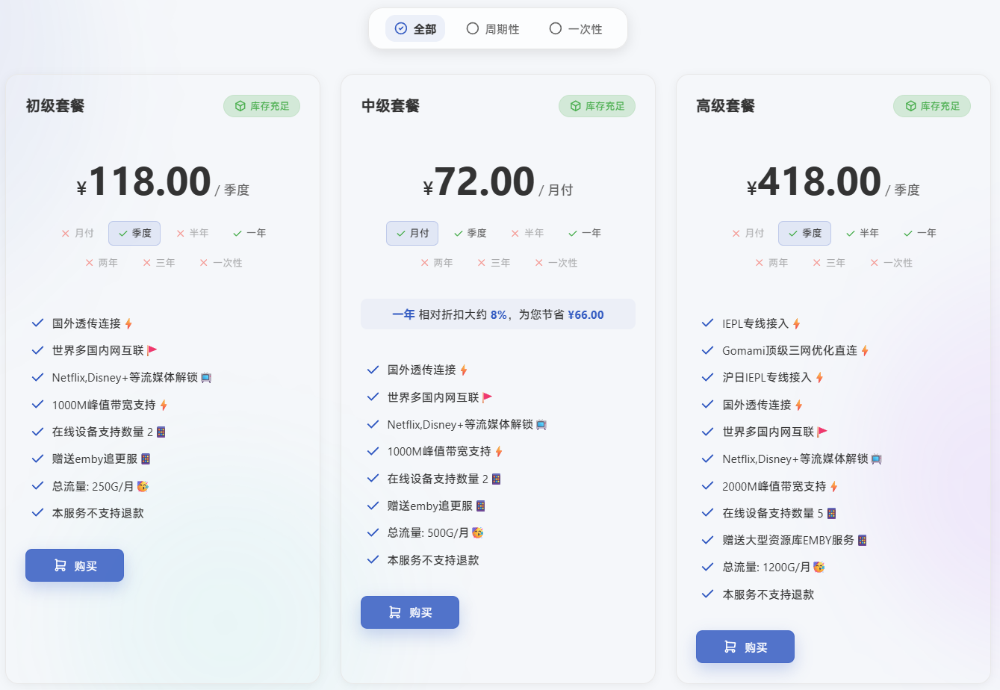

### 奶昔
**套餐价格：¥74.55/200GB ¥123.33/500GB  ^  ¥170.1/500G(中美金融专线)**

特点：
* 主流节点都有、节点质量高，速度快！
* 解锁Netfilx、Disney+等主流流媒体平台的区域限制！
* 解锁ChatGPT、Claude、 Gemini、Cursor等主流 AI 工具的区域限制！
* 注意！最多【2】个设备同时链接使用！可以加购日本、美国、韩国 Anycast网络·中美金融专线！

[官网跳转](https://nxonearth.com/signupbyemail.aspx?MemberCode=a382c243c1454800a5680e4ff54aa67220260518153643)

套餐价格

节点列表

  

单线程测速

  

### 肯の机
**套餐价格：￥35/100GB ￥70/200GB ￥105/300G ￥300/1TB**

**最新优惠：顶尖机场、顶尖体验、暂无优惠！前期建议先买最便宜测试使用！**

特点：
* 提供🚀GTM均衡优化入口线路负载 带V6入口 GOMAMI DMIT等入口 AKARI等出口
* 速率高达2Gbps、无限制同时连接 IP 数！ 附带部分家宽节点！
* 全1倍率节点,赠超低0.01倍率！
* 解锁全流媒体解锁和全AI解锁！！！

[官网跳转](https://kendeji.io/#/auth?invite=uu15Kzxj)

套餐价格

测速图

### 苏菲家宽

**最新优惠：🔥五一活动(5.1-5.15)优惠码：51888🔥**

套餐价格：¥50/800GB【星链版】¥9.9/1TB【纯直连】¥20/250G【美国静态家宽车】¥40/550GB【美国动态家宽】

特点：
* 💎内有日本、美国等星链家宽、IEPL专线、真实ISP指纹，原生住宅环境！
* 💥包含全套静态节点 (美/日/台/英/尼/欧) 具体看套餐简介！晚高峰优秀！
* 🔥另外有专属美国家宽车只要20￥/250GB！具体注册查看即可！

[苏菲家宽官网](https://sufe.pro/#/register?code=wRwmqe9Q)

套餐价格

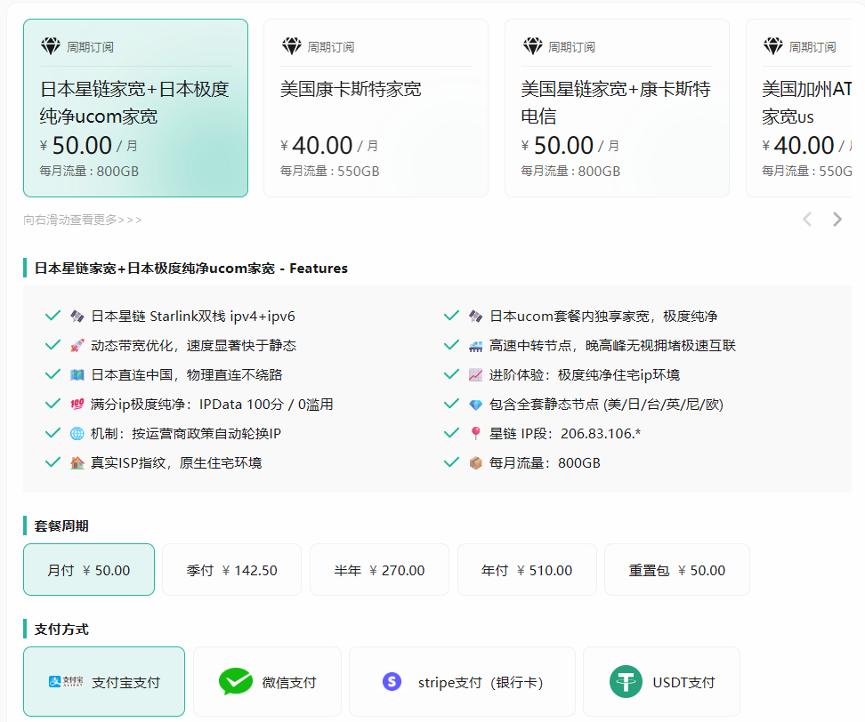
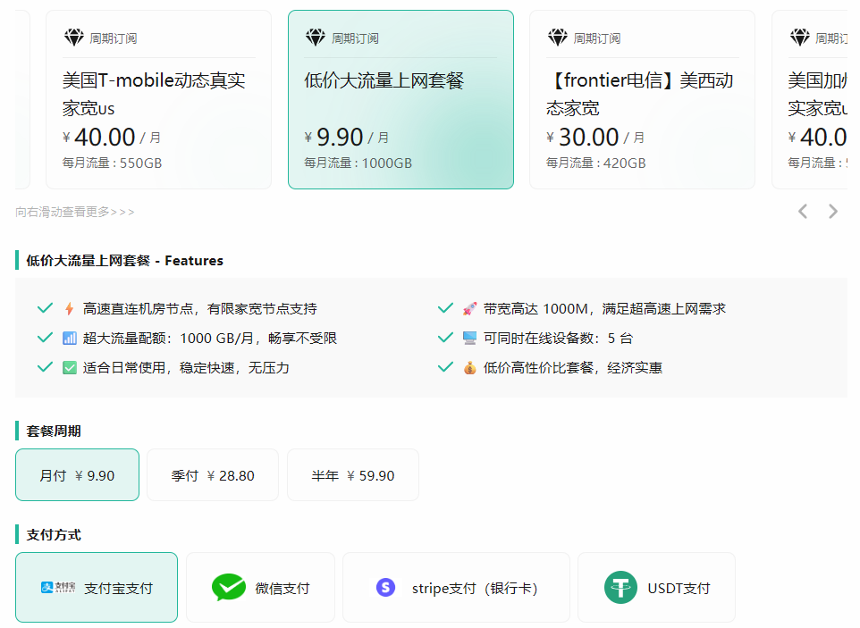
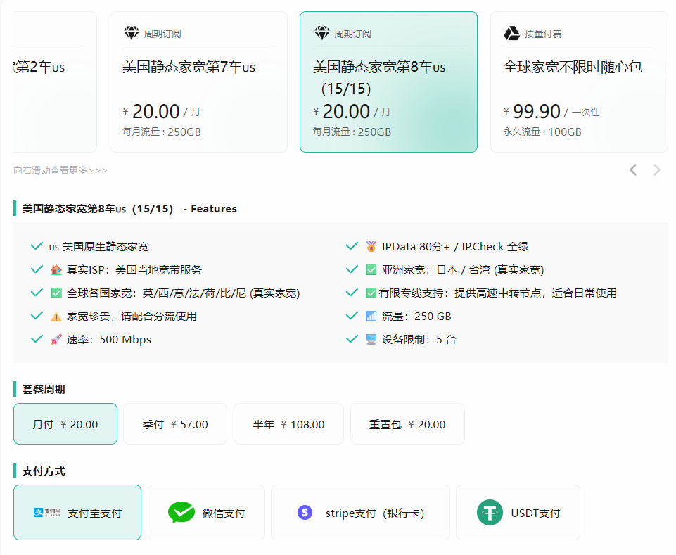

### 上帝世界
套餐价格：¥15/50GB,¥25/100GB,¥75/300GB (仅支持月付)

特点：
* 🎖️采用顶尖线路：电信 CN2GIA · 联通 9929 · 移动 CMIN2！
* 🎯不限制客户端数，不限速！随便使用！
* 🧩解锁Netfilx/Hulu/Hbo/Disney+/Dazn等流媒体
* 🚀 四网超低延迟，畅享极速网络体验！

[上帝世界官网](https://god-world.com/#/register?code=Dp1RYGLE)

套餐价格

测速&解锁

### 悦通
[悦通官网](https://my.yue.to/#/register?code=JqCr6Tpn)

**最新优惠：🔥五二零活动(5.18-5.23)七折优惠码：YUE520**

**近期专属节点与普通节点均已完成升级优化，整体速度与体验进一步提升!**  
带💎套餐为家宽套餐(带💎套餐目前有台湾/美国/日本/韩国/越南五大家宽节点与专属AI节点)  
**$${\color{red}{另有不定期余额抽奖、有永久套餐、支持链式代理！还有Emby专属!}}$$**  
强烈建议使用《[专属APP](https://yue.to/download.html)》不然有的节点不通且无emby！！  

**套餐价格：¥14.9/1TB（月付） ¥22.9/500G（长期） ¥599/永久**  强烈建议购买带💎的家宽套餐，普通套餐体感一般！

特点：
* **专属APP签到送流量**,**TG群聊可以二次签到、日常群里不定时送官网余额抽奖等！**
* 基本买个长期包能一直用，每天签到+积分兑换流量用不完！
* 顶级专线资源的“降维打击”：不同于市面上的普通公网中转，悦通在核心节点（港/台/日/新/美）部署了 Premium 和 专属 高端线路。
* 硬核配置：接入 HKT (香港电讯)、Hinet (台湾中华电信)等企业级资源。
* 购买套餐免费送永久Emby！
* 解锁 Netflix、YouTube、TikTok、OpenAI 等主流服务
* [-节点列表点我查看-](https://status.yue.to/status)支持的地区包括：香港、台湾、🇯🇵 日本、🇰🇷 韩国、🇸🇬 新加坡、🇺🇸 美国、🇨🇦 加拿大、🇻🇳 越南、🇲🇾 马来西亚、🇹🇭 泰国、🇮🇳 印度、🇦🇪 阿联酋、🇪🇸 西班牙、🇸🇪 瑞典、🇳🇱 荷兰、🇩🇪 德国、🇬🇧 英国、🇷🇺 俄罗斯、🇹🇷 土耳其、🇳🇬 尼日利亚、🇧🇷 巴西、🇦🇺 澳大利亚、澳门、🇲🇳 蒙古、🇰🇭 柬埔寨、🇲🇲 缅甸、🇱🇦 老挝、🇵🇭 菲律宾、🇮🇩 印度尼西亚、🇵🇰 巴基斯坦、🇹🇱 东帝汶、🇦🇫 阿富汗、🇺🇦 乌克兰、🇻🇦 梵蒂冈、🇧🇲 百慕大、🇬🇱 格陵兰、🇦🇷 阿根廷、🇨🇺 古巴、🇪🇬 埃及、🇸🇴 索马里、🇫🇯 斐济、🇸🇧 所罗门群岛、🇬🇺 关岛、🇦🇶 南极洲…… 节点数量多、分布广，随时畅享全球高速网络！
* 379元终身永久不限量99T高速流量
* 599元终身永久不限流量，无限带宽，买断即享，彻底告别流量焦虑

[悦通官网](https://my.yue.to/#/register?code=JqCr6Tpn)

套餐价格

  
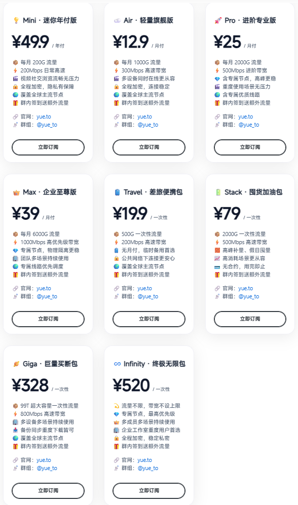

### 雪山机场

套餐价格：¥9.9/500GB（月付）    ¥39.9/1500GB（不限时） ¥799 三不限！永久买断！

特点：
* 有家宽节点（香港，台湾，韩国等）、套餐赠送EMBY期限跟套餐时间一样！
* 订阅任意套餐即可免费使用 Emby，三端均可使用！
* 内有推广专用包，可以自行分销！
* 套餐为不限设备连接数量、随便使用但滥用会封禁！
* **包含原生，家宽节点**

[雪山机场官网](https://www.xueshan.shop/#/register?code=h0lPgItf)

套餐价格

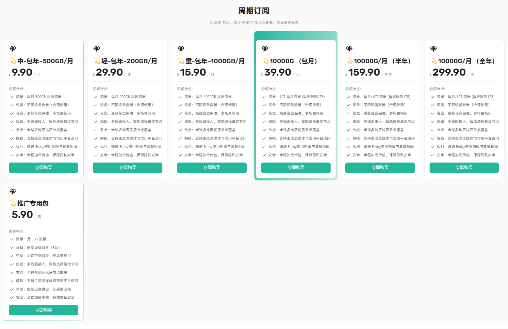

测速图

流媒体解锁情况

### 雨燕云
套餐价格：¥13.8/158G  ¥29.8/512G 

特点：
* CN2/9929/CMIN2 六线智能BGP负载均衡
* 50+ 全球节点可选、节点丰富！
* 支持访问各类AI网站以及流媒体网站
* 个人使用不限制设备数量！

[官网跳转](https://new4.yuyan.online/#/register?code=Pe2RS8uV)

套餐价格

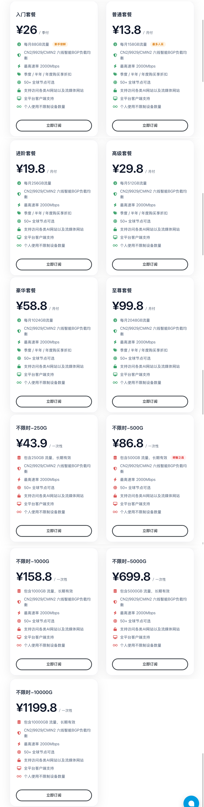

三网测速

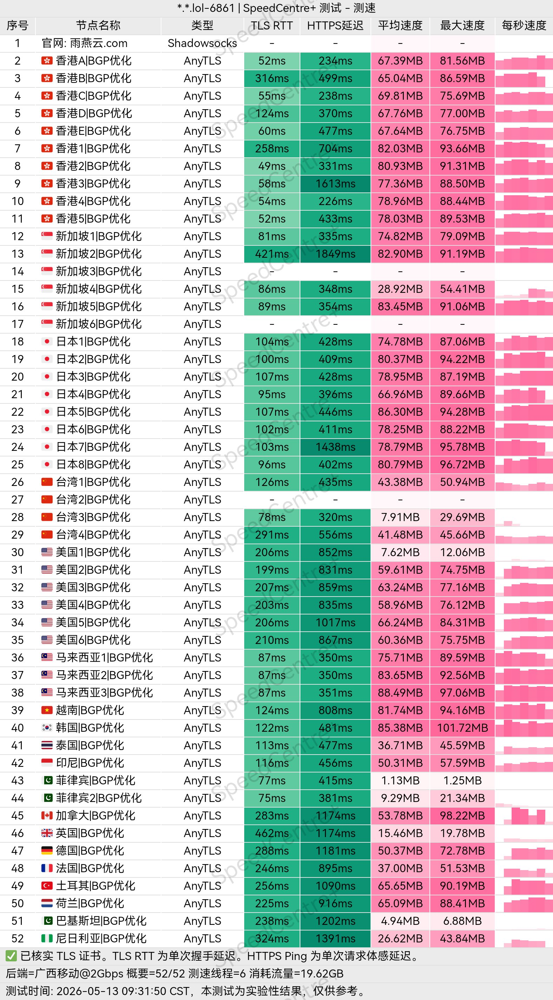移动
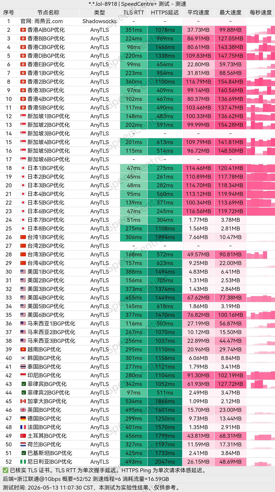联通
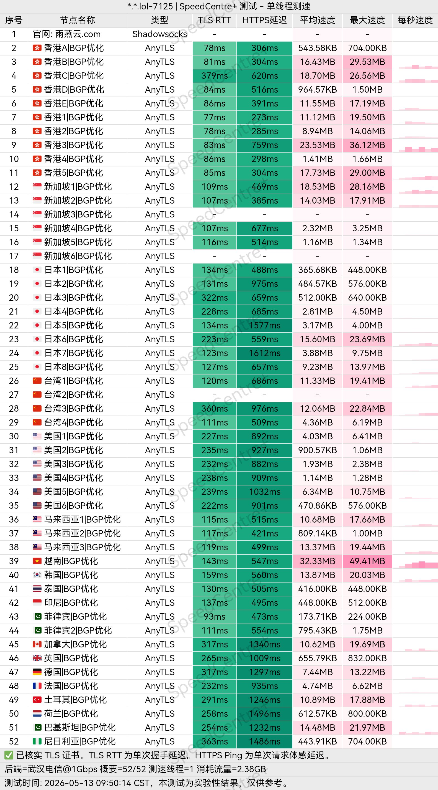电信

流媒体解锁

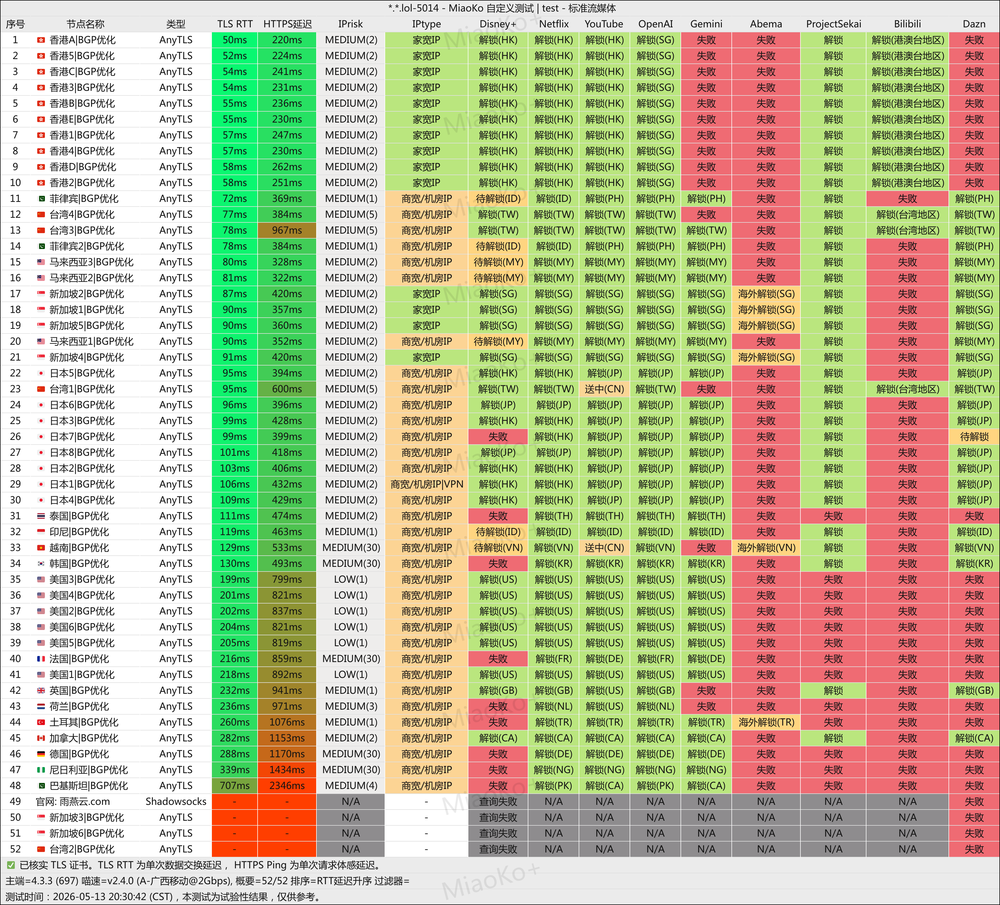

### 落云

套餐价格： ¥12/300G（月付）¥23/600GB（月付） **此机场不定时更换价位、需要早买以防涨价！折扣码：60FFF**

特点：
* 南极 冰岛等稀缺iP 原生iP 住宅iP
* 解锁：Netflix, ChatGPT, Gemini 等
* 网速不限速 同时在线设备不限制 可改抖音iP 小红书iP
* 节点三网优化 带宽5Gbps+ 线路80+

[落云官网](https://88888.ee88.tk/#/register?code=UVI42l9q)

套餐价格

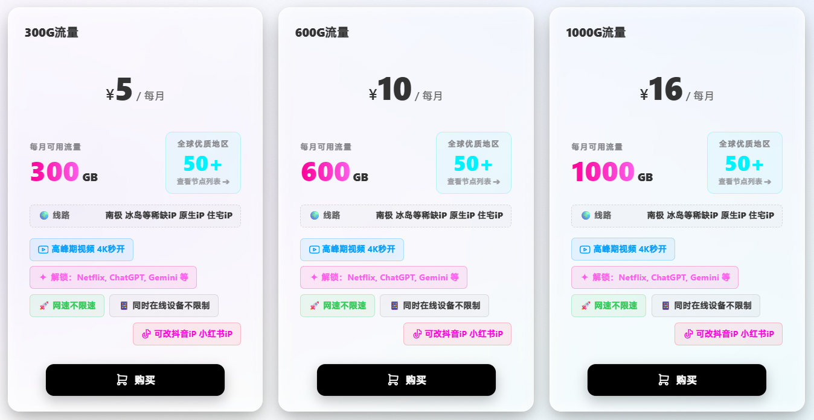

### XSUS

套餐价格：¥12/168GB 

IEPL企业专线套餐：￥52季付/50G

特点：
* 有越南、美国、日本、香港台湾澳门等家宽节点，同时也是五年老牌机场！
* 服务超级稳定、超低延迟、节点众多！速度快！
* 三网延迟优化，节点丰富，体验很好！
* 拥有专属IPEL专线，游戏节点等企业专线套餐！

[XSUS官网](https://xsus3.com/register?code=6LiiWirT)

套餐价格

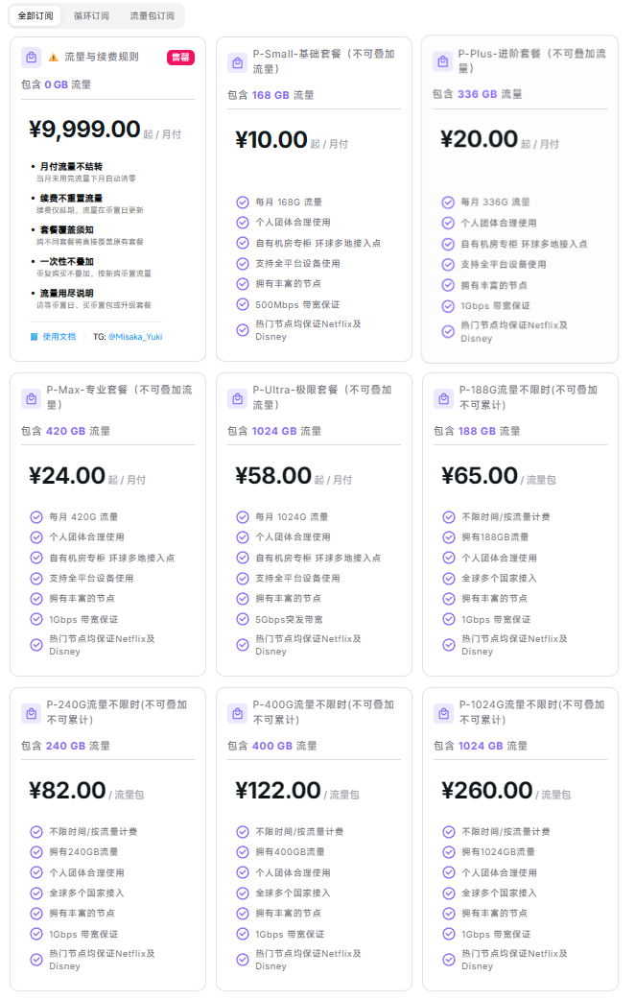

### XFLTD

套餐价格：¥7/150GB ¥14/300GB ¥24/120G(长期)

特点：
* 有🇭🇰 香港、🇯🇵 日本、🇹🇼 台湾、🇸🇬 新加坡、🇺🇸 美国等节点，同时也是六年老牌机场！
* 服务稳定、超低延迟、性比价较高！协议目前为AnyTLS为主！
* 三网延迟优化，节点丰富，体验很好！
* 拥有优质公网中转线路，延迟优化良好！

[XFLTD官网](https://www.xfltd.org/#/register?code=ptlnb86g)

套餐价格

### 良心云
套餐价格：¥2/100GB,¥4/500GB

特点：
* 支持新疆，河南，福建，用户使用
* 无限制使用行为，无存储节点日志
* 高速三网优化专属节点！内有0.5x节点！

[良心云官网](https://xn--9kqz23b19z.com/#/register?code=yZcE4Uf3)

套餐价格

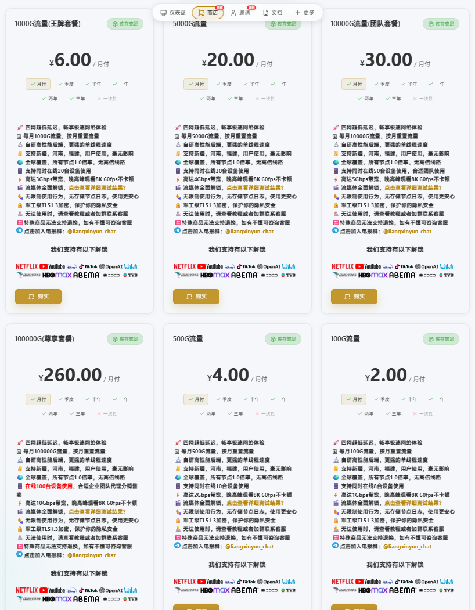

测速

### 搅局者
套餐价格：￥10.9年付/每月500GB & ￥16.9一年/不限量 · 但限制设备2台！

特点：
* 提供提供[Basic]和[Premium]系列节点，包括香港，台湾，新加坡，日本，美国等节点
* 无限流量+无速度限制！支持下载/观影 EMBY爽看！
* 解锁常见流媒体与AI等

[搅局者官网](https://xn--dgtr4ppoz.com/#/register?code=PWV5Y7dc)

套餐价格

测速图

流媒体&AI解锁图

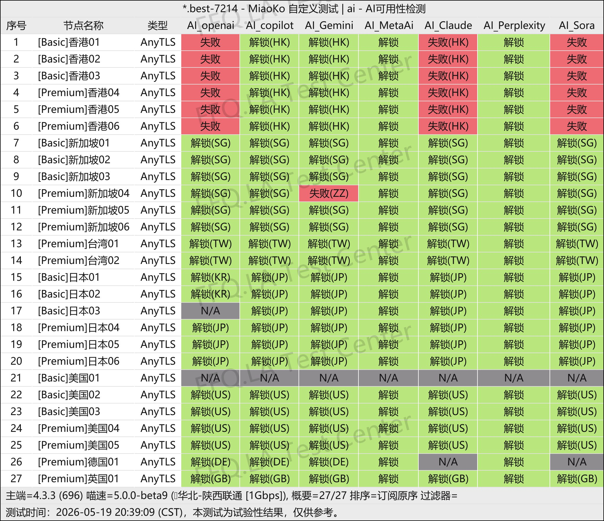
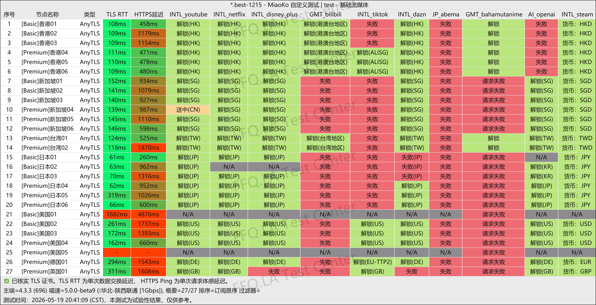

### 飞鸟云
套餐价格：¥12年付/50G(平均1元/月) ¥24年付/100G(平均2元/月) ¥15/400G(月付) ¥10/200G(不限时)

特点：
* ✅地区: 🇺🇸 美国 🇯🇵 日本 🇸🇬新加坡 🇹🇼 台湾 🇭🇰 香港
* ✅大多数为Hysteria2协议+少量Vless协议
* ✅不限网速，不限设备数量！
* ✅建议当作备用的不二之选！

[飞鸟云官网](https://fn1.476579.xyz/#/register?code=CPxiG6b6)

套餐价格

测速图

### 星链机场
套餐价格：¥12/188GB ¥35/688G,三网优化IPLC专线，50+地区节点

特点：`注册就有永久免费888PB/永久 不限速套餐`
* ⚡️ 三网优化IPLC专线，高速且极低延迟
* 🔒 全线路安全加密，无需担心隐私泄露
* 🌈 流媒体、AI网站、海外工具等全解锁
* 💻 不限设备数，不限制速度！
* 🌍 全球超100个节点，50+国家可供选择

[星链机场官网](https://xship.top/?TyW6eXj)

套餐价格

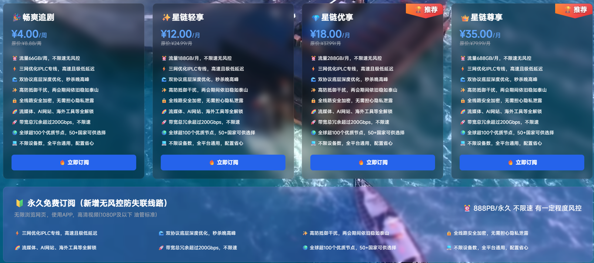

### 牢大云
套餐价格：¥8/52GB ¥15/128GB ¥48/512GB

特点：`注册就有永久免费免费999999G不限速套餐·限制1台设备`
* ✅ IEPL专线节点+跨境电商原生家宽IP
* 🔥 流媒体、AI网站、海外工具等全解
* 🔒 AnyTLS加密，限制设备数根据套餐价位有所不同

[牢大云官网](https://laodayun.com/#/register?code=BlatljSN)

套餐价格

### Kitty Network

套餐价格：￥24年付/128G（平均2元/月）

特点：
* 不限速，不限在线设备数量
* 解锁 Netflix，Disney+，ChatGPT等

[Kitty Network官网](https://kitty.sb/#/register?code=UZPduMjD)

套餐价格

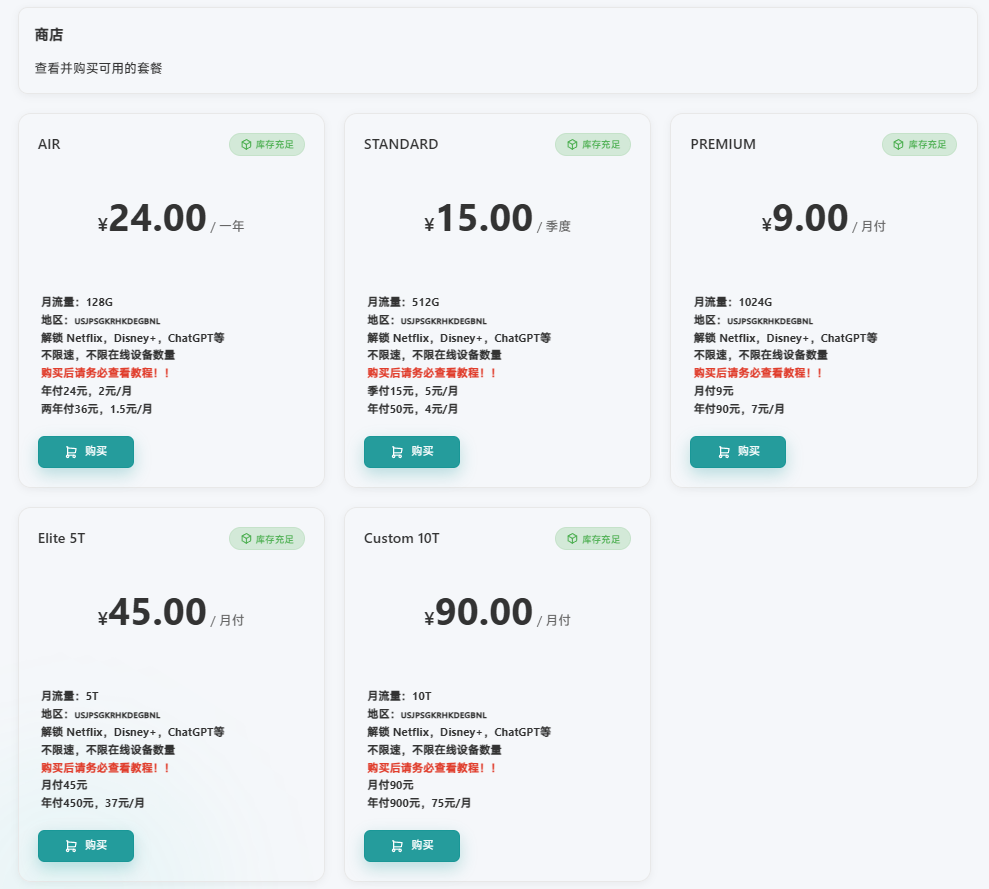

### 墨菲云
套餐价格：¥3.2/222GB(直连+家宽)¥6.6/1111G(直连+家宽) ¥21长期/222GB(直连+家宽)

特点：
* 直连+中转+家宽 有0.1x节点  另外有专属公益套餐！
* 分销版:¥32/1000GB(带ISP家宽) 地区 🇭🇰 🇲🇴 🇹🇼 🇯🇵 🇸🇬 🇰🇷 🇺🇸 🇬🇧 原生/家宽双 ISP/商宽节点
* 家宽低延迟节点为1.1x~1.5x、三网优化!
* 稳定解锁流媒体奈菲、迪士尼、TikTok、ChatGPT 等
* 永久95折折扣码：**MFXY95%yyds**

[墨菲云官网](https://portal.mofeiyun.com/#/register?code=6pErwD6V)

套餐价格

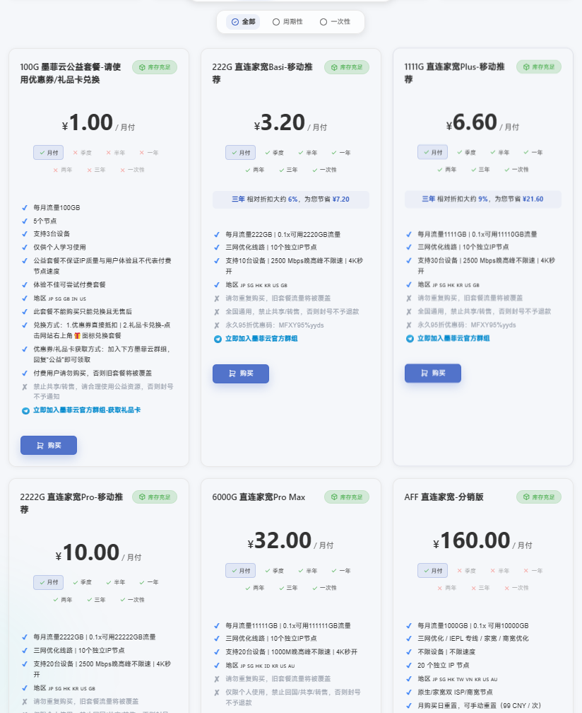

测速图

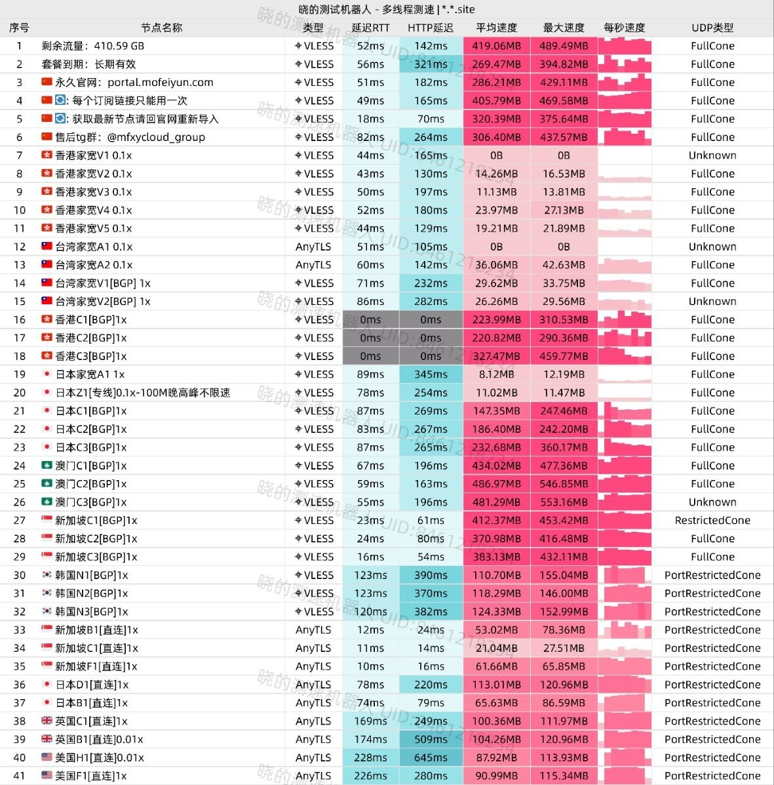

### 赔钱机场
套餐价格：¥1.5/100G,¥2.99/500G  ¥18.9/1TB长期,¥68.9/4TB长期

特点：
* 🔒全线路安全加密，保护隐私安全
* 🎉包含0.1倍率低扣费福利下载节点
* 🪽不限制下载速度，流畅访问互联网
* 🎬稳定解锁流媒体奈菲、迪士尼、TikTok、ChatGPT等
* 🔥电信联通移动 三网专项优化

[赔钱机场官网](https://xn--mes358aby2apfg.com/register?code=esmud6xa&cover=sfw)

套餐价格

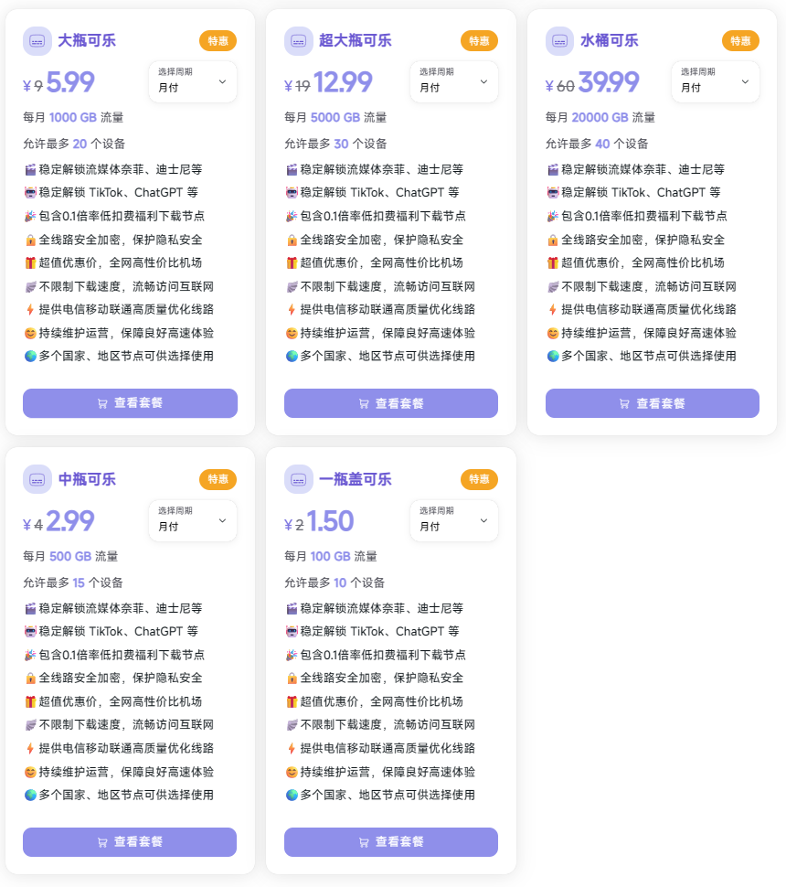
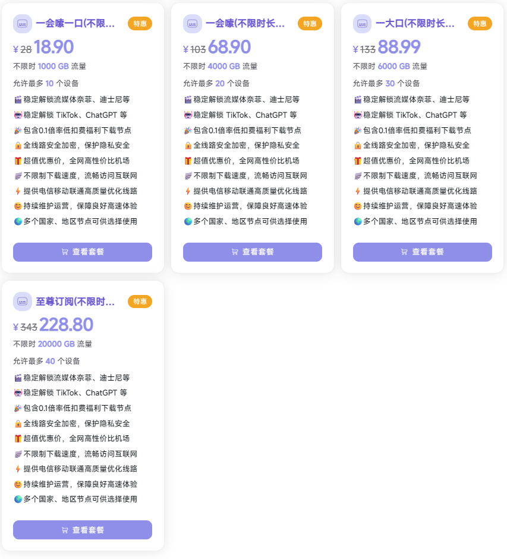

测速图

### 一分机场
套餐价格：¥2/100GB , ¥6/1TB , ¥11.88/100G(长期)

特点：
* ⚡️提供三网高质量线路
* 🚀线路带宽最高速度20000Mbps
* 🔒全线路安全加密,保护隐私安全！
* 🎬稳定解锁流媒体Netflix、Bilibili、ChatGPT等
* 注：🈲不允许滥用分享,每日最大套餐20%的使用量，超过需等凌晨0点恢复使用！

[一分机场官网](https://xn--4gqx1hgtfdmt.com/#/register?code=dP76b44a)

套餐价格

### 狗子云
套餐价格：¥3/168GB ¥5/168(分销版)

特点：
* 提供原生IP，动态住宅IP支持[奠信晚高峰一般，移动联通均可]
* 内带分销套餐，可以自行销售！
* 内含0.1x 倍率节点、套餐速率分套餐等级
* 解锁 OpenAI / Netflix / TikTok / YouTube 等热门服务 

[狗子云官网](https://gz-cloud.top/#/register?code=kDV2n3tI)

套餐价格

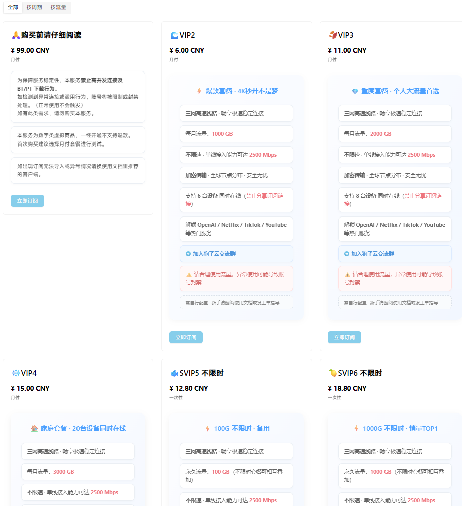
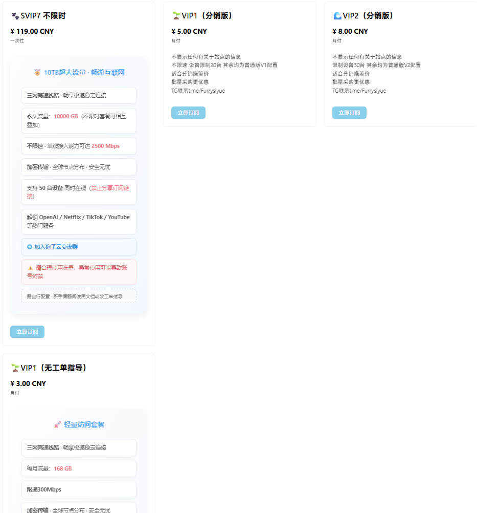

### 蜜雪冰城
套餐价格：¥3/100GB ¥21/1TB 另外有永久套餐！

特点：
* 有电信专属优化,BGP与0.5x低倍率节点！
* Netfilx/Hulu/Hbo/Disney+/Dazn等流媒体
* 有永久套餐，速度快！不过节点主要为港日美！

[蜜雪冰城官网](https://kad520.uk/#/register?code=5UplgCKR)

套餐价格

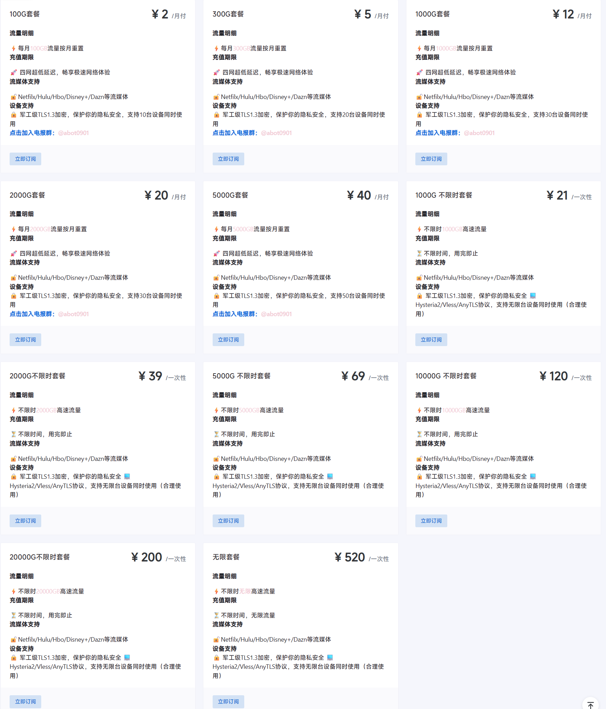

测速图

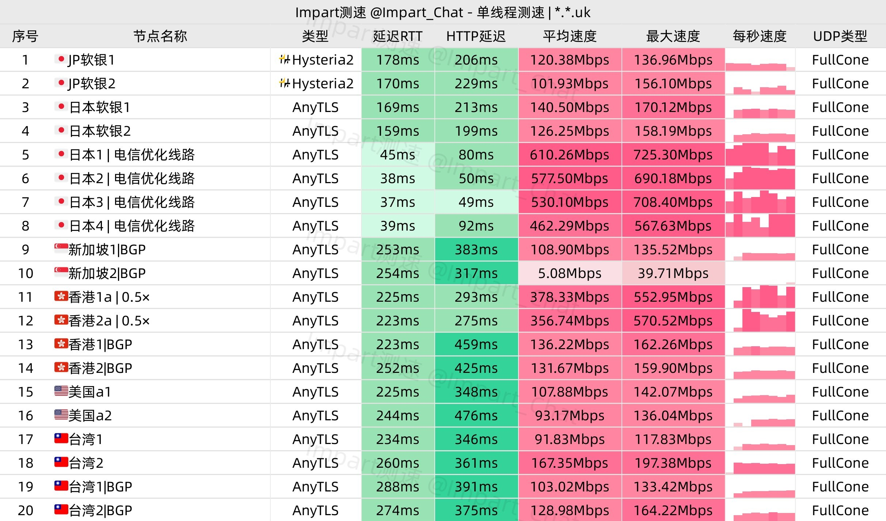

### 果冻加速

套餐价格：¥9.9/不限量（月付）

特点：
* 速度快、无审计、不限量！
* 适合流媒体！PT下载！节点较少为日、美、港
* 解锁 Netflix，Disney+，ChatGPT等

[果冻加速官网](https://naichachong.com/#/register?code=yO3p6doW)

### 西数
**套餐价格：¥20/200GB ¥40/400GB ¥60/600GB**

特点：
* 国际 IPLC 传输线路+中国大陆 BGP 多线接入!
* 解锁Netfilx、Disney+等主流流媒体平台的区域限制！
* 解锁ChatGPT、Claude、 Gemini、Cursor等主流 AI 工具的区域限制！

[西数官网](https://wd-gold.net/aff.php?aff=14681)

套餐价格

